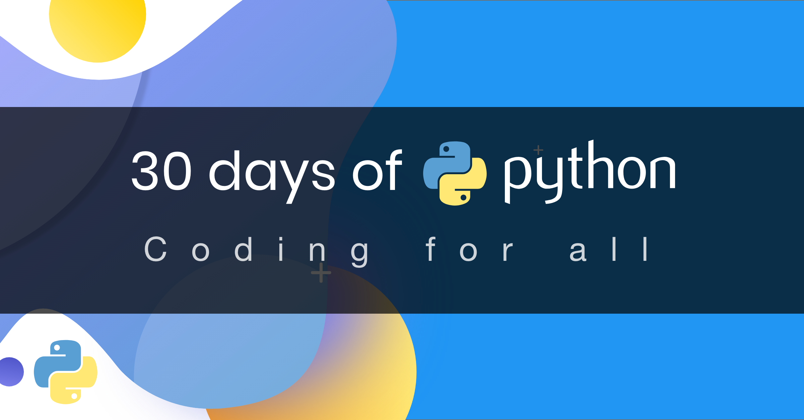

# Learning-Lab

My learning journey — university coursework + self-taught study, on the way to becoming an AI Engineer

---

## 🎯 About

I'm a Computer Engineering student @ UniPa, currently doing a Data & AI internship @ Accenture.
This repo collects what I study and build — both from my degree and on my own — as I work
toward becoming an expert AI Engineer.

---

## 📂 What's inside

### Assembly
ARM32 assembly routines from my Computer Architecture course: low-level programming,
memory access, stack usage and condition flags using VisUAL2

### Java
Exercises from this semester's Java course: OOP, collections, streams, debugging exercises

### Python
Self-taught Python, working through the 30 Days of Python challenge: fundamentals,
algorithms, and building toward AI/ML use

### Projects
Small standalone projects, university or personal, that don't fit into a single course bucket
